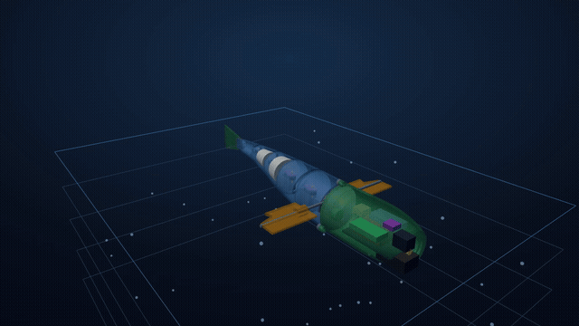

# 🐟 Bio-Inspired Underwater Eel Robot



*Travelling-wave swim, a bow-plane dive through the depth rings, and a see-through
body showing the internals (battery, ESP32, foam, keel) — a deterministic
**HyperFrames** render of the actual 3D scene (`cad/make_video.py`).
▶ [Full-quality MP4](output/eel_demo.mp4) · 🖥️ [live interactive viewer](output/eel_design.html).*

A ~50 cm anguilliform (eel-style) underwater robot: a free-flooding, segmented
body that swims with a travelling body wave, dives with bow planes, and carries a
camera + light in a sealed head. Tethered, 3D-printable, desk/pool scale.

This repo is a **complete digital design package** — parametric CAD,
first-principles engineering analysis, ESP32 control firmware, full build docs,
and a researched BOM. The whole pipeline regenerates and self-checks at
**28/28** (`python verify_all.py`), and it passed four rounds of independent
review. It is a *verified design*, not yet a physically-built robot.

### Start here
- 📄 **[Full design report](PROJECT_REPORT.md)** — the story + every decision, in plain language.
- 🖥️ **Interactive viewer + datasheet** — open [`output/eel_design.html`](output/eel_design.html) in any browser (3D model, internals, all the numbers; no install).
- 🛠️ **[Build guide](docs/build_guide.md)** · 🧾 **[BOM](docs/BOM.md)** · 🏭 **[Manufacturing](docs/manufacturing.md)** · 🔌 **[Wiring](docs/wiring_pinout.md)**
- 🔍 **[Independent design review](docs/design_review.md)** — 4 rounds of external critique + responses.

### Reproduce it
```bash
pip install cadquery numpy matplotlib
python verify_all.py          # regenerates all parts + reports, checks 28/28
```

### Headline numbers (predicted — confirm in the tank)
| | |
|---|---|
| Size / mass | 500 × 70 mm / ~390 g dry |
| Stability | neutral buoyancy, roll +8 mm, ~2° trim |
| Cruise (predicted) | ~0.53 m/s, 2 Hz tail-beat, Strouhal 0.22–0.44 |
| Depth | rated 2 m (head bay good to ~84 m before buckling) |
| Power | ~6.7 W avg, sized for ~4 A peak |

### Status
✅ Digital design complete + validated (CAD, analysis, firmware source, docs, BOM).
⬜ Physical build remains (compile/flash firmware, buy exact parts, print, seal,
wet-test) — these need hardware, by design. See the report's "done vs. next".

---
*Built as a code-driven parametric design. Single source of truth:
[`cad/params.py`](cad/params.py).*
