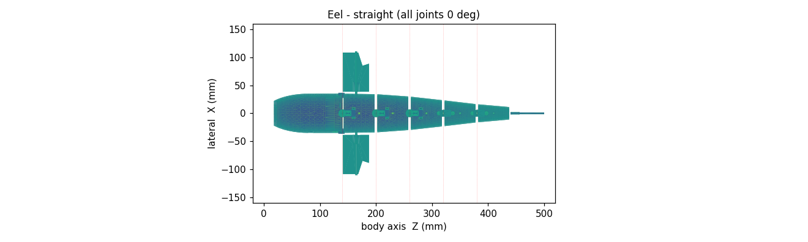
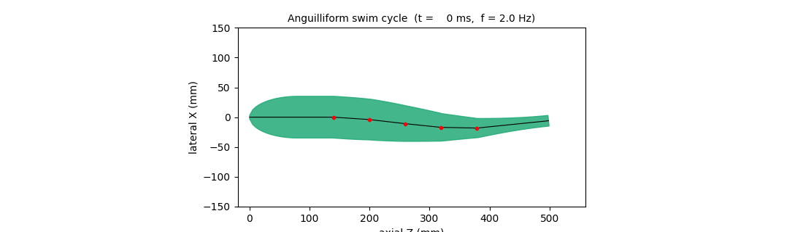
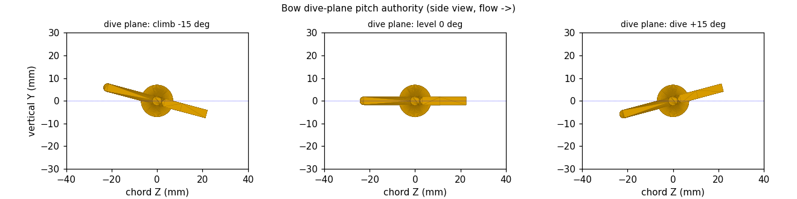
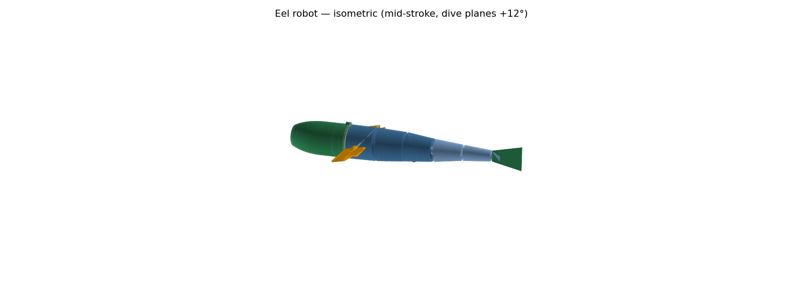
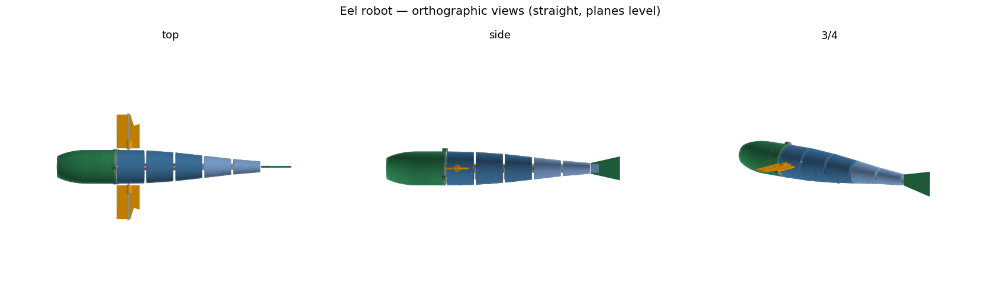
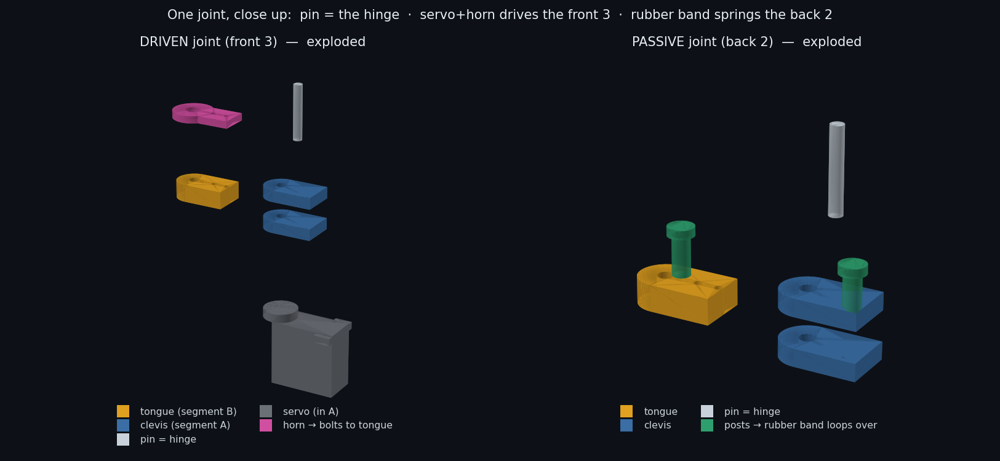
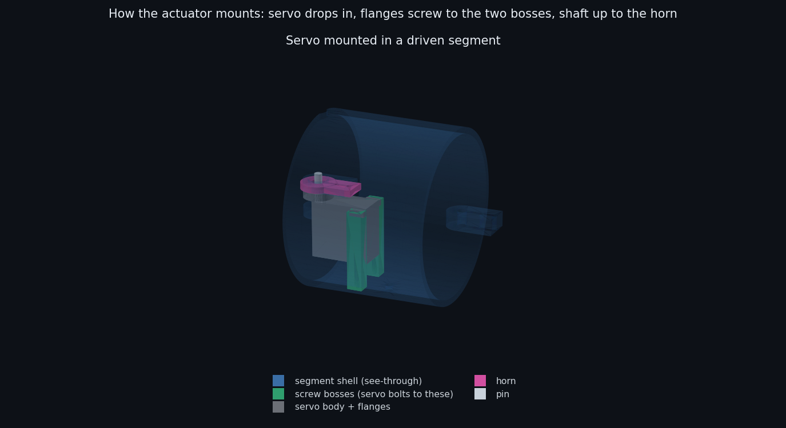

# Bio-Inspired Underwater Eel Robot

A from-scratch design package for an **anguilliform (eel) underwater robot** —
a ~500 mm desk/pool prototype that swims by undulating a chain of **5 revolute
joints** (front 3 servo-driven), with **bow dive planes for active depth
control (3-D diving)** and an **FPV camera + LED headlight** looking out a
clear nose window — so it's a usable mini-ROV, not just a swimmer. Everything
here is parametric and runnable: change one number in `cad/params.py` and the
CAD geometry, the physics sizing, and the gait all update together.

> Scope: desk/pool prototype tier — ~50 cm, shallow (<2 m), tethered,
> 3D-printed, hobby metal-gear servos. Re-parameterize to scale up.

---

## 1. What's in the box

```
eel_robot/
├─ cad/                 CadQuery parametric CAD (run these to get STEP/STL)
│  ├─ params.py         SINGLE SOURCE OF TRUTH — all dimensions & physics
│  ├─ joints.py         revolute joint hardware (tongue + clevis + pin)
│  ├─ body.py           tapered free-flooding body segments (seg1..seg5)
│  ├─ head_bay.py       sealed dry electronics bay + O-ring lid
│  ├─ assembly.py       full kinematic chain → STEP / SVG / print STLs
│  ├─ dive_planes.py    bow dive planes (active depth control → 3-D)
│  ├─ skin.py           flexible TPU skin sleeve (covers joint gaps)
│  ├─ test_rig.py       bollard-thrust test cradle (bench tool)
│  ├─ test_coupons.py   fit/seal coupons (servo, potting cup, O-ring)
│  ├─ ballast.py        keel strap, trim rail/carrier, foam retainer
│  ├─ tail_flexure.py   3 TPU passive-tail flexure variants (bench-pick)
│  ├─ hull_solid.py     watertight single hull for CFD meshing
│  ├─ render.py         top-view + dive-plane previews (QA only)
│  ├─ render3d.py       shaded 3-D isometric + orthographic renders
│  ├─ web_viewer.py     → output/eel_viewer.html (interactive browser 3-D)
│  └─ design_page.py    → output/eel_design.html (ALL-IN-ONE shareable page)
├─ analysis/
│  ├─ sizing.py         drag, buoyancy/ballast, gait, torque, power budget
│  ├─ structures.py     pressure-hull stress, buckling depth, pin shear, seal
│  ├─ swim_sim.py       Lighthill self-propulsion + swim_cycle.gif
│  ├─ dive.py           dive-plane lift, min dive speed, descent rate
│  ├─ stability.py      CG vs CB, roll + trim, foam/keel sizing
│  ├─ power.py          peak current, brownout, tether voltage drop
│  ├─ tail_stiffness.py passive-tail spring rate / TPU-flexure thickness
│  └─ dive_linkage.py   dive 4-bar: 1:1 kinematics + servo holding torque
├─ firmware/
│  ├─ gait.py           anguilliform gait generator (Python reference)
│  └─ eel_gait.ino      ESP32 port: PCA9685 + 4 servos + leak cutoff
├─ cfd/                 OpenFOAM steady drag case (you run the solve)
│  ├─ case_setup.py     stage hull STL + report Reynolds / drag
│  ├─ 0/ constant/ system/   standard simpleFoam dictionaries
│  └─ README.md         how to run + read the drag coefficient
├─ docs/
│  ├─ README.md         this file
│  ├─ BOM.md            bill of materials (AliExpress link on every line)
│  ├─ manufacturing.md  materials, print settings, tolerances, sealing
│  ├─ build_guide.md    step-by-step build + build-readiness checklist
│  ├─ joints.md         joint / DOF reference table
│  ├─ wiring_pinout.md  pin-level wiring table (matches eel_gait.ino)
│  └─ wiring.drawio     editable electronics block diagram
├─ verify_all.py       run the whole pipeline, report PASS/FAIL (one command)
└─ output/             all generated artifacts (STEP, STL, SVG, PNG, GIF, TXT)
```

---

## 2. Quick start

```bash
# one-time: install the CAD kernel (large — pulls OpenCascade)
python -m pip install cadquery numpy matplotlib

# regenerate everything
cd cad
python params.py        # prints the parameter/geometry summary
python joints.py        # output/joint_demo.{step,stl}
python head_bay.py      # output/head.stl, output/lid.stl
python body.py          # output/test_seg1.stl, test_seg5.stl
python assembly.py      # output/eel_straight.*, eel_swim.*, print_*.stl
python dive_planes.py   # output/print_dive_plane.stl, print_dive_shaft.stl
python skin.py          # output/print_skin.stl  (flexible sleeve)
python test_rig.py      # output/print_test_rig.stl
python hull_solid.py    # output/cfd_hull.{stl,step}
python render.py        # output/preview_*.png  (top + dive views)
python render3d.py      # output/render3d_iso.png, render3d_views.png (shaded 3-D)
python joint_detail.py  # output/joint_detail.png (exploded joint close-up)
python web_viewer.py    # output/eel_viewer.html (interactive, animated, browser)

cd ../analysis
python sizing.py        # output/sizing_report.txt
python structures.py    # output/structures_report.txt
python swim_sim.py      # predicted cruise speed + output/swim_cycle.gif
python dive.py          # output/dive_report.txt  (dive performance)
python stability.py     # output/stability_report.txt  (CG/CB, roll, trim, foam/keel)
python power.py          # output/power_report.txt  (peak current, tether drop)
python tail_stiffness.py # output/tail_stiffness_report.txt  (flexure/band sizing)
python dive_linkage.py   # output/dive_linkage_report.txt  (1:1 kinematics + torque)

cd ../firmware && python gait.py       # prints the servo command table

# optional CFD drag study (needs OpenFOAM on Linux/WSL/Docker):
cd ../cfd && python case_setup.py && ./Allrun
```

Or just run everything and check it all still passes:

```bash
python verify_all.py     # runs every script in order → PASS/FAIL table
```

Open `output/eel_swim.step` in any CAD viewer (FreeCAD, Fusion, Onshape) to
inspect the articulated assembly; slice `output/print_*.stl` to 3D-print.

> Tested with Python 3.13 + cadquery 2.7.0. If `pip install cadquery` fails on
> your Python, create a 3.11/3.12 virtual-env — OCP wheels are most reliable
> there.

---

## 3. Key results (current parameters)

> **Predicted, not validated.** Every performance number below (speed, drag,
> Strouhal, dive, descent) is a first-order *estimate* from the analysis scripts
> — assumed `Cd`, Lighthill EBT with a 0.5 derate, **no CFD solve and no wet
> test**. Treat them as design targets to confirm in the tank, not measured
> results. Geometry/mass/buoyancy/torque are computed from the CAD and are firmer.

| Quantity | Value | Source |
|---|---|---|
| Length × max dia | 500 × 70 mm (nose truncated at z=18 for the window) | `params.py` |
| DOF | 3 driven + 2 passive body joints + dive planes (4 servos total) | `params.py` |
| Joint travel | ±28° | `params.py` |
| Payload | analog FPV camera + dimmable LED headlight behind a Ø30 acrylic nose window | `head_bay.py` |
| Displaced volume | ~1105 cm³ | `sizing.py` |
| Dry mass | ~390 g (4 servos + camera + LED) | `sizing.py` |
| Inherent buoyancy (free-flood) | +150 g positive (add ballast to neutral) | `sizing.py` |
| Cruise drag @ 0.3 m/s | ~17 mN | `sizing.py` |
| Tail-beat frequency | 2.0 Hz (cruise) | `params.py` |
| Cruise joint amplitude | 7° (28° max in reserve) | `params.py` |
| Predicted cruise speed | ~0.53 m/s (1.1 BL/s) realistic; 1.07 m/s EBT upper bound | `swim_sim.py` |
| Strouhal | 0.22 at the EBT speed; ~0.44 at the derated speed (pool-tune) | `swim_sim.py` |
| Dive planes | 63 cm² (2 fins, 1 servo), ±25°, root clear of hull+skin | `dive.py` |
| Min dive speed / descent rate | 0.24 m/s / ~0.5 m/s | `dive.py` |
| Servo torque margin | ~40× (at full ±28° travel) | `sizing.py` |
| Electrical load | ~6.7 W incl. 2 W light (0.91 A @ 7.4 V) | `sizing.py` |
| Pressure-hull collapse depth | ~84 m (rated 2 m) | `structures.py` |
| Joint-pin shear SF | ~13× | `structures.py` |
| O-ring squeeze | 25% (ideal 15–30%) | `structures.py` |
| Hull vol. CAD vs analytic | 1105.9 vs 1104.8 cm³ (0.1%) | cross-check |

Design previews (straight, mid-stroke, and the animated swim cycle):






Shaded 3-D (`cad/render3d.py`):




How one joint goes together (`cad/joint_detail.py`) — pin = hinge, servo+horn
drives the front 3, rubber band springs the back 2:



How the servo mounts inside a segment — drops in, flanges screw to two printed
bosses, shaft up to the horn:



**★ THE shareable design page — `output/eel_design.html`** (built by
`cad/design_page.py`): one self-contained file with the live swimming 3-D fish
**plus** a spec dashboard, a clickable parts catalogue (click a part → it
highlights on the fish and shows material / size / power / qty / price / **where
to buy**), and the full BOM with buy links. This is the single file to share.

**Minimal viewer — `output/eel_viewer.html`** (built by `cad/web_viewer.py`):
just the live 3-D model + controls, no catalogue. Lighter if you only want the
geometry. Both double-click to open; three.js loads from a CDN (internet on
first open).

**To view in proper CAD (rotatable, measurable):** open `output/eel_swim.step`
or `eel_straight.step` in **SolidWorks** (File → Open → the `.step`), FreeCAD,
Fusion 360, or Onshape. STEP imports as a full solid assembly.

---

## 4. Design decisions you should confirm

1. **Free-flooding vs. fully sealed body.** A sealed 70 mm body displaces
   ~1.1 L and would need ~740 g of ballast — heavier than the whole robot.
   The package therefore assumes **free-flooding tail segments** (water fills
   seg1..seg5 through printed drain holes, the waterproof servos run wet) with
   only the **head bay sealed**. That drops ballast to ~150 g. If you want a
   fully sealed body instead, each segment needs end bulkheads + shaft seals
   and a lot of buoyancy trim.

2. **Skin sleeve.** The segmented body has gaps at each joint (visible in the
   swim preview). A flexible **TPU/silicone sleeve** over the spine restores a
   smooth hydrodynamic surface and keeps debris out. It is modeled in
   `cad/skin.py` (→ `print_skin.stl`, with flex grooves at each joint and
   clearance holes where the dive shaft exits); print it in TPU or use it as
   a mould core for silicone.

3. **Diving is dynamic, not static.** The bow dive planes give 3-D depth
   control but need forward flow: the robot dives/climbs **while swimming** and
   holds depth by neutral trim. It **cannot hover-descend at zero speed** — for
   that you'd add a variable-buoyancy engine. Performance in `analysis/dive.py`.

4. **Front 3 joints driven, rear 2 passive (compliant tail).** A 9 g servo
   won't fit the thin tail (seg5 is only ~32 mm dia), so the last two joints
   carry **no servo** — they're a springy tail the body wave flexes on its own,
   like a real fish. Fewer servos also means lighter + more buoyant. Rubber
   bands loop between **printed anchor posts** (in the segment STLs, hanging
   from the shell ceiling either side of each passive joint); tune band count/
   tension to the ~2 Hz beat — or swap in a TPU flexure / silicone element.

5. **The lid carries the joint-1 tongue and all three penetrations.** The
   drivetrain plugs into the back of the lid; tether gland +12 mm above the
   axis, epoxy-potted servo/leak wire gland −12 mm below, MS5837 sensor port
   at x = +14 mm (the sensor reads ambient pressure through the flooded seg1
   behind the lid). Unpin joint 1 → the lid and the electronics tray slide
   straight out.

6. **Camera + light = the payload.** An analog FPV camera (5 V, composite out)
   and a 1–3 W LED sit *inside the dry bay* behind a Ø30 acrylic disc bonded
   into the truncated nose — zero extra waterproofing. Video runs topside on a
   spare tether pair into a $8 USB capture dongle; the light dims over serial
   (`W 0..1`). WiFi/digital cameras were rejected: 2.4 GHz dies in centimetres
   of water; composite-video-over-a-pair is the proven cheap-ROV approach. The
   flat nose face costs a little drag vs. the ogive tip — the staged CFD case
   can estimate/check that difference **once you solve it** (it isn't solved here).

---

## 5. Division of labor

**Software / design (in this repo):** all parametric CAD scripts + the revolute
joints, the physics/sizing math, the gait generator + ESP32 firmware, the wiring
diagram, the BOM, and these docs — all parametric, so any parameter change
re-derives the geometry and the analysis.

**Physical build (off-repo):** run the scripts, inspect/print the STLs, buy
parts, assemble, waterproof the head bay, wire & solder, run CFD if desired, and
do the physical pool testing. Organic skin/nose surfacing is the one CAD piece
best done by hand in a GUI.

---

## 6. Build sequence

Cheap coupons + fits **first**, then the body. Pass/fail thresholds: `build_guide.md` §12.

1. **Print the coupons** (`coupon_servo.stl`, `coupon_oring_bore/plug.stl`,
   `coupon_potting.stl`) → confirm your servo fits its pocket, the O-ring seals
   on *your* printer, and a potted wire bundle survives a soak. Don't print the
   body until these pass.
2. **Print one segment + the joint demo** → confirm the clevis/tongue/pin fit
   and the revolute moves freely. Tweak `PIN_CLEAR`, `CLEVIS_GAP` in `params.py`.
3. **Print head + lid** → bond the nose window, fit electronics, fit the 3 M3
   lid-clamp ears; **dry sink/seal test the empty bay first**, then pot the wire
   gland + sensor port (`manufacturing.md` §6).
4. **Print seg1..seg5 + tail fin + the TPU flexures** (`print_flexure_*.stl`);
   assemble the chain with pins + servos. The passive tail is a **TPU flexure**
   (bench-pick the variant that hits f_n, §12); rubber bands over the anchor
   posts are the **fallback**, not primary.
5. **Print + fit the ballast hardware** (`print_keel_strap.stl`,
   `print_trim_rail.stl`, `print_trim_carrier.stl`, `print_foam_retainer.stl`).
6. **Compile + flash `eel_gait.ino`** (ESP32 core 2.0.x + Adafruit PWM +
   BlueRobotics MS5837 — **compile it yourself; the source is not
   compile-verified in this repo**). Bench-test the travelling wave (servos
   sweeping in phase), the camera (USB capture) and the headlight (`W 0.5`).
7. **Ballast & trim** in a tub to neutral buoyancy (~150 g, see `sizing.py`).
8. **Tethered pool test** → tune amplitude/frequency/heading; measure speed vs.
   the Strouhal target. Iterate parameters → re-print affected parts.

> ⚠️ Always do the **dry pressure/leak test of the head bay before any powered
> submersion.** The firmware halts on a leak, but seal first, trust second.

---

## 7. Validation (analysis stage D) — what's already built

- **Gait phasing:** `firmware/gait.py` generates + sanity-checks the
  travelling-wave commands (software reference; not a wet test).
- **Self-propulsion:** `analysis/swim_sim.py` predicts cruise speed (Lighthill
  EBT) and renders `output/swim_cycle.gif`. EBT is an upper bound (×0.5 derate
  → realistic estimate).
- **Structure/sealing:** `analysis/structures.py` confirms the hull, pin, and
  O-ring have large margins at the 2 m rating (bay good to ~84 m).
- **CFD drag:** `cfd/` only **stages** a `simpleFoam` case (geometry + Reynolds
  + an analytic drag estimate); it is **not solved here**. Run it on
  Linux/WSL/Docker to get a measured drag coefficient, then feed it back into
  `CD_AXIAL` in `params.py` and re-run sizing/swim_sim — the loop.
- **Bench:** print `print_test_rig.stl`, mount the robot, tether to a force
  gauge → measured bollard thrust vs. `swim_sim.py`. Then free-swim speed run.

---

## 8. Open items (not blocking)

- Exact servo model → set `SERVO_BODY_*` and `SERVO_TORQUE_RATED` in `params.py`.
- 3D-printer build volume → may force splitting longer parts.
- Tether length + topside controller (laptop USB-serial vs RC).
